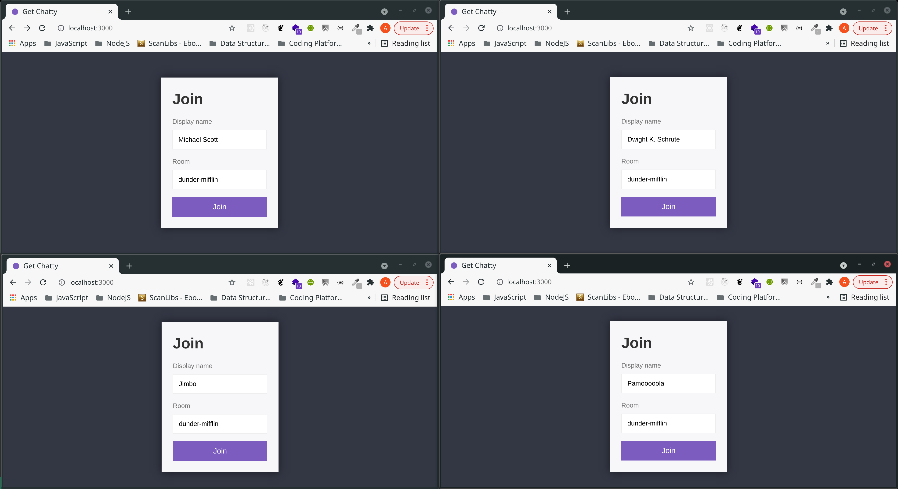
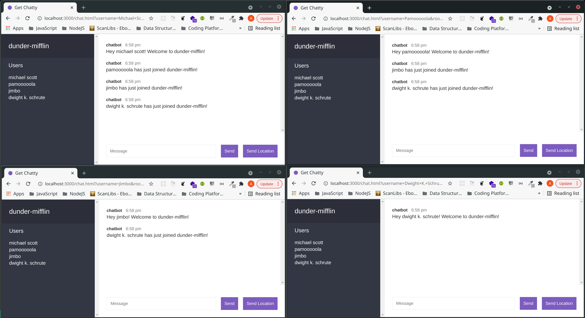
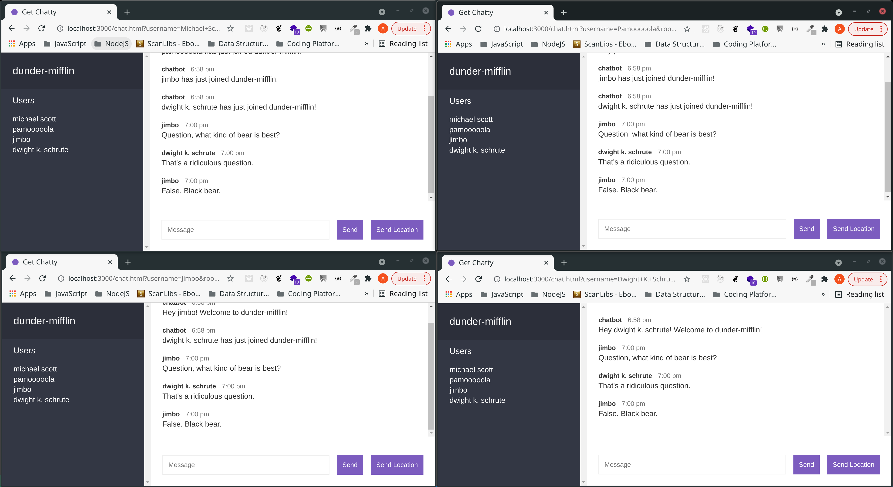
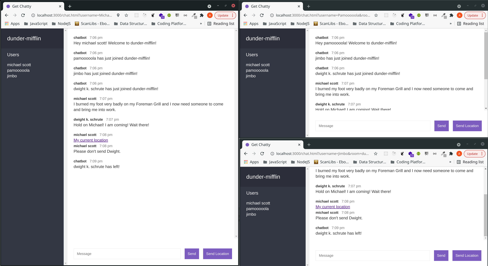

# Get Chatty

> A real-time, multiroom chat app built with Express.js and Socket.IO.
> It relies on the WebSocket protocol in order to let users join rooms where they can send messages and share their current geolocation.

<a href="https://get-chatty.herokuapp.com/" target="_blank">Try it here</a>

## Table of Contents

- [Get Chatty](#get-chatty)
  - [Table of Contents](#table-of-contents)
  - [General Information](#general-information)
  - [Technologies and Libraries Used](#technologies-and-libraries-used)
  - [Install](#install)
  - [Available Scripts](#available-scripts)
    - [`npm run start-dev`](#npm-run-start-dev)
    - [`npm start`](#npm-start)
    - [`npm test`](#npm-test)
  - [Features](#features)
  - [Screenshots](#screenshots)
  - [Room for Improvement](#room-for-improvement)
  - [License](#license)

## General Information

- This application makes use of full-duplex communication provided by WebSocket to enable users to join and participate in a chat room.

## Technologies and Libraries Used

> - **node** - version 16.11.1 (https://nodejs.org/it/)
> - **express** - version 4.17.3 (http://expressjs.com/)
> - **socket.io** - version 4.4.1 (https://socket.io/)
> - **nodemon** - version 2.0.15 (https://nodemon.io/)
> - **env-cmd** - version 10.1.0 (https://www.npmjs.com/package/env-cmd)
> - **bad-words** - version 3.0.4 (https://www.npmjs.com/package/bad-words)

## Install

The complete list of dependencies is included in `./package-lock.json`.\
Run `npm install` to install all dependencies.

## Available Scripts

In the project directory, you can run:

### `npm run start-dev`

Runs the app in the development mode with `nodemon` command to monitor for any changes in your source and automatically restart your server.\
Open [http://localhost:3000](http://localhost:3000) to view it in the browser.

### `npm start`

Runs the app in the development mode with `node` command.\
Open [http://localhost:3000](http://localhost:3000) to view it in the browser.

### `npm test`

WIP

## Features

> - A user can choose a display name and type the chat room they want to join;
> - When a user joins a room, they can send messages and share their location with other users;
> - Users of a room get notified when someone joins or leaves the room;
> - Data for each user is not stored on a database, therefore it is avaiable as long as the socket is connected. As soon as the socket is disconnected, all its related data is wiped.

## Screenshots

&nbsp;&nbsp;
&nbsp;&nbsp;
&nbsp;&nbsp;

## Room for Improvement

Todo:

- [ ] Implement an actual REST service.

## License

This project is distributed under Open Source license.
